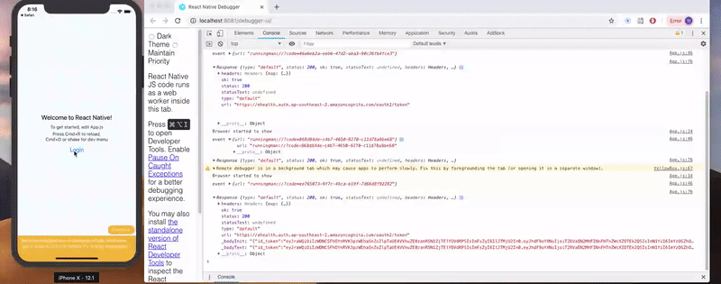

# Example of how to use AWS Cognito Hosted UI with Active Directory Federated Identity provider in React native

Fill in your client id in Cognito domain and run the project.

## Note:

Response type must be code which is Code Grant for OAuth2.0, if you set to token (Implicit Grant), you won't get refresh tokens.

This example is only for iOS version.

```
npm install --save
react-native run-ios
```


